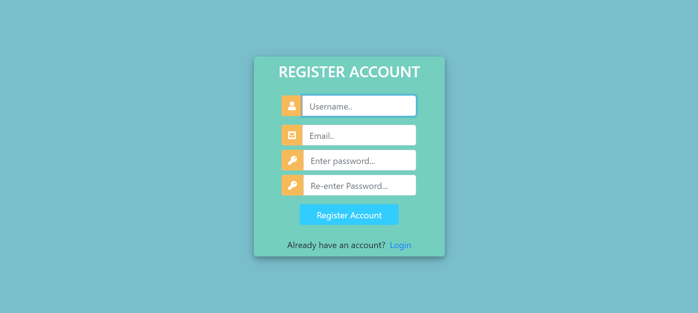
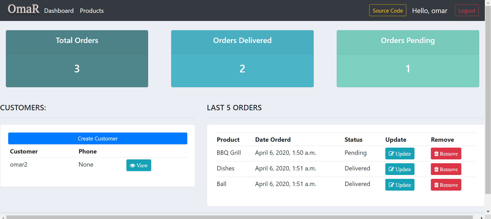
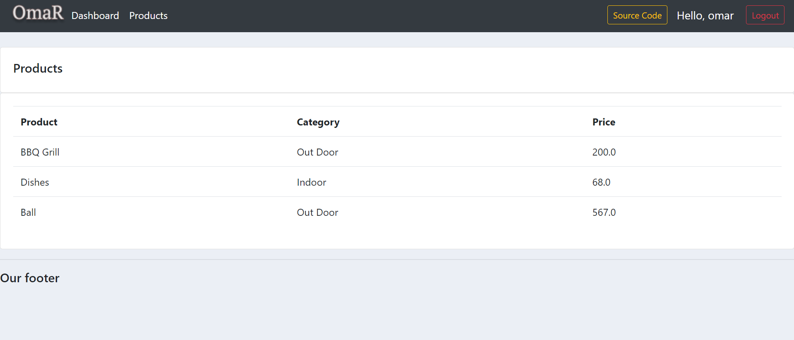
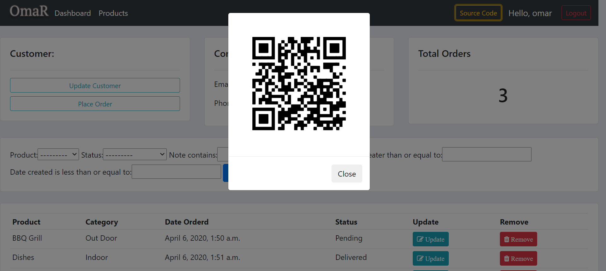

# Customer Relationship Management (CRM) 
*This is a customer relationship management (CRM) project with Python, Django and SQLite. By using this web application you can keep track your customers, orders, profiles and also can add, update and delete etc,....*

# Features
* You can create Customer.
* You can Place Order according to Customer.
* You can Create, Delete, Update (I used here CRUD Operations).
* You can search manually, Dynamically.
* You can see details for individual profile.
* You can see all in Dashboard.
* User-friendly.

# Tools
## Front-end Part
* HTML
* CSS
* Bootstrap
## Back-end
* Django
* SQLite 3

# Screenshots of the Project

  
  
  
  

**Copyright (c)** 2020-3020 Md. Omar Faruk

## Go Through This Site Then You Will Know About This Site Properly.
